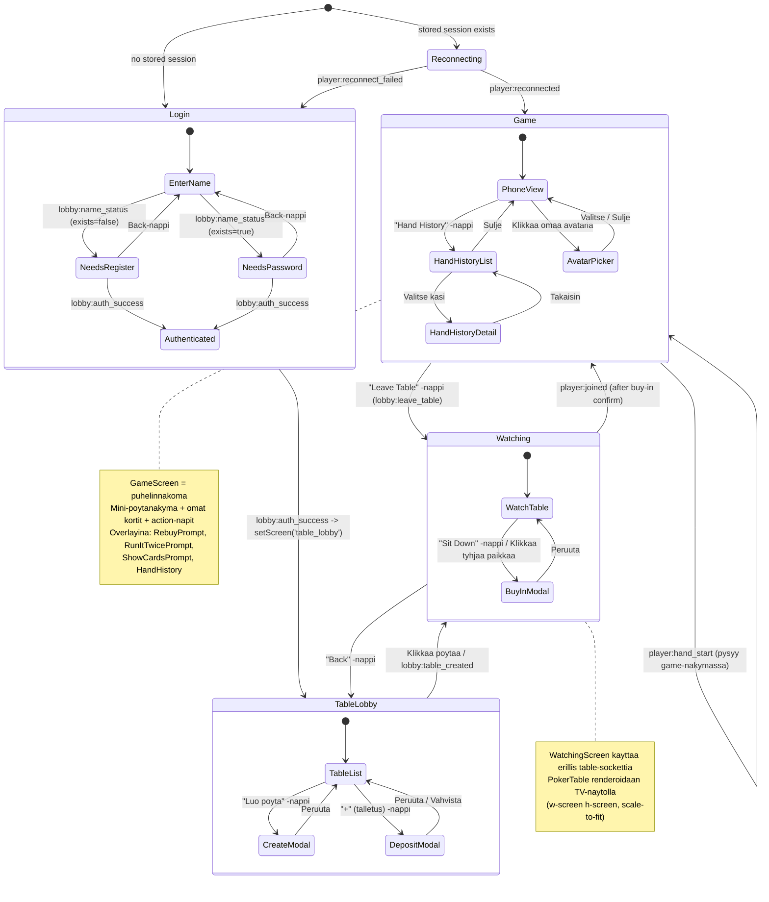
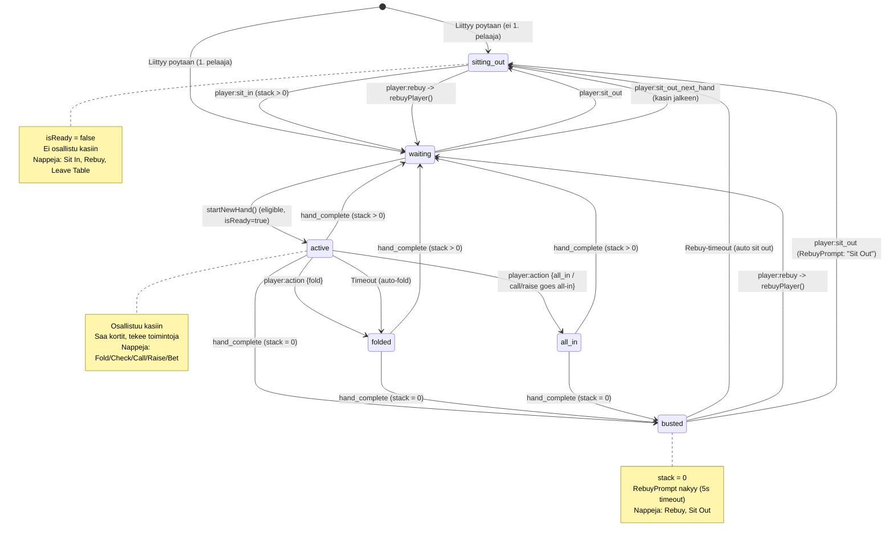
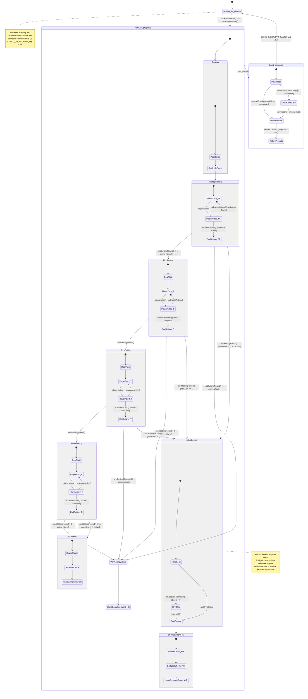
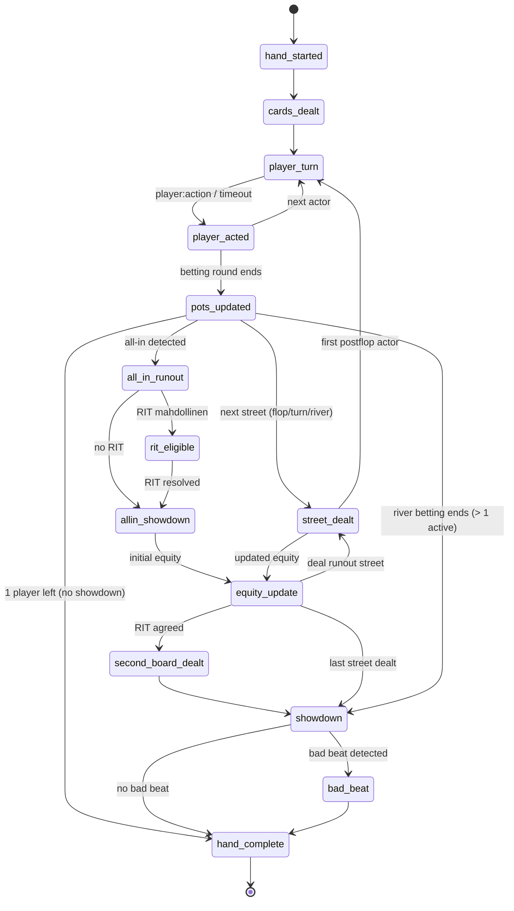
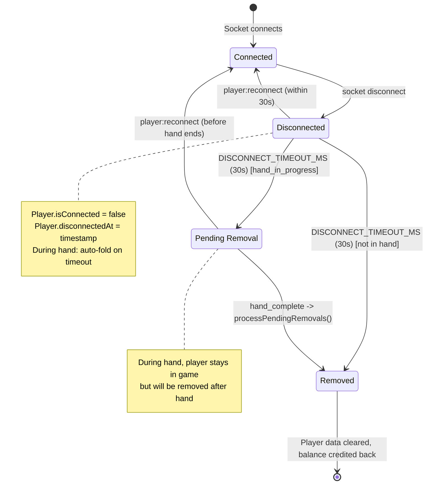
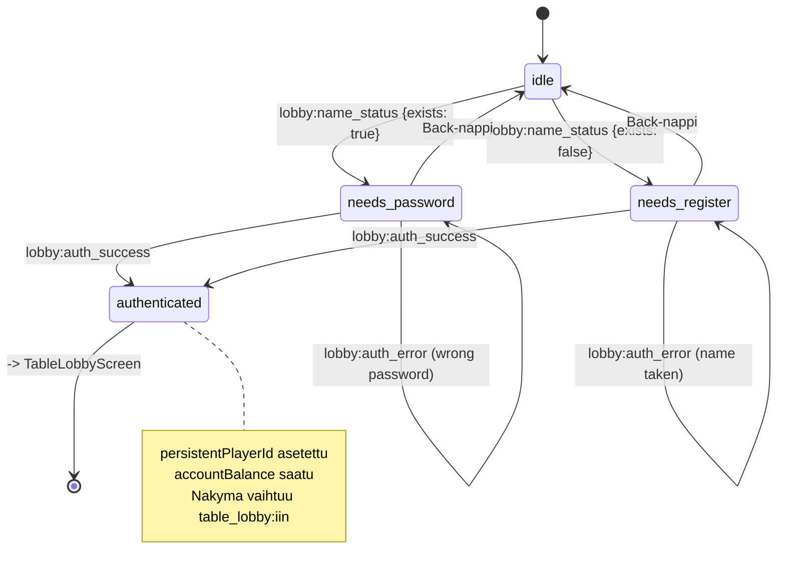

# Pelisoftan tilakaaviot (State Machines)

Tama dokumentti kuvaa pelisovelluksen kaikki tilasiirtymat: nakymat, pelaajan statukset,
pelin vaiheet, napit ja socket-eventit. Mermaid-kaaviot on rakennettu koodipohjan
perusteella (maaliskuu 2026).

---

## 1. Nayttonakymien tilakaavio (Client Screens)

Client-puolen nakymat maaritellaan `useGameStore`-tilassa:
`'login' | 'table_lobby' | 'watching' | 'lobby' | 'game'`

Lisana on `reconnecting`-valitila joka nakyy ennen muita nakymia.

---

## 2. Pelaajan status-tilakaavio (PlayerStatus)

Serverin `Player.status` -tyypit:
`'sitting_out' | 'waiting' | 'active' | 'folded' | 'all_in' | 'busted'`

---

## 3. Pelin vaihekaavio (GamePhase - serveri)

Serverin `GameManager.phase`:
`'waiting_for_players' | 'hand_in_progress' | 'hand_complete' | 'paused'`

---

## 4. Kasin sisainen tapahtumavirta (HandEngine Events)

---

## 5. Nappien ja toimintojen lista

### 5.1 LoginScreen

| Nappi / Toiminto | Tila/Ehto | Socket-event | Kohde |
|---|---|---|---|
| "Jatka" (Enter name) | authState = 'idle' | `lobby:check_name` | Server tarkistaa nimen |
| "Kirjaudu" (Login) | authState = 'needs_password' | `lobby:login` | Autentikointi |
| "Luo tili" (Register) | authState = 'needs_register' | `lobby:register` | Rekisterointi + avatar |
| "Takaisin" (Back) | needs_password / needs_register | - (client-only) | Palaa nimensyottoon |

### 5.2 TableLobbyScreen

| Nappi / Toiminto | Tila/Ehto | Socket-event | Kohde |
|---|---|---|---|
| "Luo poyta" (Create Table) | isConnected | `lobby:create_table` | Luo uuden poydan |
| Poytarivi (klikkaus) | - | - (client-only) | setScreen('watching') |
| "+" (Deposit) | - | `lobby:deposit` | Tallettaa saldoa |
| Stake Level valinta | Modal auki | `lobby:create_table` | Luo valitulla panoksella |

### 5.3 WatchingScreen (TV-nakyma)

| Nappi / Toiminto | Tila/Ehto | Socket-event | Kohde |
|---|---|---|---|
| "Back" | - | - (client-only) | setScreen('table_lobby') |
| "Sit Down" | accountBalance > 0 | - | Avaa buy-in modal |
| Tyhjaa paikkaa klikkaus | - | - | Avaa buy-in modal (valittu paikka) |
| Buy-in vahvistus | buyInAmount > 0 | `lobby:join_table` | Liittyy poytaan |
| Buy-in peruutus | - | - | Sulkee modalin |

### 5.4 GameScreen (Puhelinnakoma)

#### Toimintonapit (ActionButtons) - naytetaan kun `isMyTurn && hand_in_progress`

| Nappi | Ehto (availableActions) | Socket-event | Payload |
|---|---|---|---|
| **Fold** | 'fold' in actions | `player:action` | `{ action: 'fold' }` |
| **Check** | 'check' in actions | `player:action` | `{ action: 'check' }` |
| **Call [X]** | 'call' in actions | `player:action` | `{ action: 'call', amount: callAmount }` |
| **Bet [X]** | 'bet' in actions | `player:action` | `{ action: 'bet', amount: raiseAmount }` |
| **Raise [X]** | 'raise' in actions | `player:action` | `{ action: 'raise', amount: raiseAmount }` |
| **All In** | raiseAmount == maxRaise | `player:action` | `{ action: 'all_in', amount: maxRaise }` |

#### Raise/Bet koko-saatimet

| Saadin | Toiminto |
|---|---|
| Min-preset | Asettaa minRaise |
| 1/2 Pot -preset | Asettaa 50% potista |
| Pot-preset | Asettaa 100% potista |
| All In -preset | Asettaa maxRaise (vain NLHE) |
| Slider | Liukusaadin minRaise..maxRaise |
| Numeerinen kentta | Suora syotto |
| Hiirirulla | +/- 1 big blind |

#### Pre-action napit - naytetaan kun `!isMyTurn && hand_in_progress && hasCards && !folded`

| Nappi | Toggle | Auto-toiminto vuorolla |
|---|---|---|
| Check/Fold | preAction = 'check_fold' | check jos mahdollinen, muuten fold |
| Check | preAction = 'auto_check' | check jos mahdollinen, muuten peruutu |

#### Tila-napit (aina nakyvissa eri tilanteissa)

| Nappi / Toiminto | Nakyy kun | Socket-event |
|---|---|---|
| **Sit In** | status = 'sitting_out' && stack > 0 | `player:sit_in` |
| **Sit Out** | !sitting_out && !busted && (!hand_in_progress tai folded) | `player:sit_out` |
| **Rebuy [X]** | busted tai sitting_out && stack = 0 | `player:rebuy` |
| **Leave Table** | sitting_out | `lobby:leave_table` |
| **Sit Out Next Hand** | !sitting_out && !busted && stack > 0 | `player:sit_out_next_hand` |
| **Auto-Muck** | !sitting_out && !busted && stack > 0 | `player:auto_muck` |
| **Hand History** | game-nakymassa | `player:get_history` |
| **Chip Trick** | Klikkaa omaa avataria (stack >= 100) | `player:chip_trick` |
| **Update Avatar** | Klikkaa omaa avataria (ei folded) | `player:update_avatar` |
| **Chat** | Aina | `player:chat` |

### 5.5 Overlay-promptit

#### RebuyPrompt (automaattinen kun busted)

| Nappi | Socket-event | Seuraus |
|---|---|---|
| Rebuy [maxBuyIn] | `player:rebuy` | stack = maxBuyIn, status -> waiting |
| Sit Out | `player:sit_out` | status -> sitting_out |
| (Timeout 5s) | `player:sit_out` | Auto sit out |

#### RunItTwicePrompt (all-in showdown)

| Nappi | Socket-event | Seuraus |
|---|---|---|
| Kylla / Yes | `player:rit_response { accept: true }` | Jos kaikki hyvaksyy -> 2. board |
| Ei / No | `player:rit_response { accept: false }` | Normaali runout |
| Aina Ei / Always No | `player:rit_response { accept: false, alwaysNo: true }` | Tallentaa preferenssin |
| (Timeout 10s) | - | Auto-decline |

#### ShowCardsPrompt (kasin jalkeen, voittaja, ei showdownia)

| Nappi | Socket-event | Seuraus |
|---|---|---|
| Nayta / Show | `player:show_cards { show: true }` | Kortit nakyvat kaikille |
| Muckaa / Muck | `player:show_cards { show: false }` | Kortit piiloon |
| (Timeout 10s) | - | Auto-muck |

---

## 6. Socket-eventit yhteenveto

### 6.1 Client -> Server (C2S)

| Event | Lahettaja | Tarkoitus |
|---|---|---|
| `lobby:check_name` | LoginScreen | Tarkista onko nimi varattu |
| `lobby:register` | LoginScreen | Rekisteroi uusi pelaaja |
| `lobby:login` | LoginScreen | Kirjaudu sisaan |
| `lobby:deposit` | TableLobbyScreen | Talleta saldoa |
| `lobby:get_tables` | TableLobbyScreen | Hae poytalistaus |
| `lobby:create_table` | TableLobbyScreen | Luo uusi poyta |
| `lobby:join_table` | WatchingScreen | Liity poytaan (buy-in) |
| `lobby:leave_table` | GameScreen | Poistu poydasta |
| `player:action` | GameScreen | Pelitoiminto (fold/check/call/bet/raise/all_in) |
| `player:reconnect` | PlayerView (auto) | Yrita yhdistaa uudelleen |
| `player:rebuy` | GameScreen / RebuyPrompt | Osta lisaa pelimerkkeja |
| `player:sit_out` | GameScreen / RebuyPrompt | Istu sivuun |
| `player:sit_in` | GameScreen | Palaa peliin |
| `player:sit_out_next_hand` | GameScreen | Toggle: istu sivuun seuraavalla kadella |
| `player:auto_muck` | GameScreen | Toggle: auto-muck |
| `player:rit_response` | RunItTwicePrompt | Vastaa Run It Twice -tarjoukseen |
| `player:show_cards` | ShowCardsPrompt | Nayta/piilota kortit |
| `player:get_history` | GameScreen | Hae kasihistoria |
| `player:get_hand` | HandHistoryDetail | Hae yksittaisen kasin tiedot |
| `player:chat` | ChatInput | Laheta chat-viesti |
| `player:update_avatar` | AvatarPicker | Vaihda avatar |
| `player:chip_trick` | GameScreen (avatar click) | Chip trick -animaatio |
| `player:report_bug` | BugReportModal | Lahetaa bugiraportti |
| `table:watch` | WatchingScreen / GameScreen | Aloita poydan seuranta (table namespace) |
| `table:unwatch` | WatchingScreen | Lopeta seuranta |

### 6.2 Server -> Client (S2C) - Player namespace

| Event | Vastaanottaja | Aiheuttaa |
|---|---|---|
| `player:connected` | PlayerView | Stake levels + server version |
| `player:joined` | PlayerView | -> setScreen('game') |
| `player:reconnected` | PlayerView | -> setScreen('game'), restore state |
| `player:reconnect_failed` | PlayerView | Clear session, stay on login |
| `player:lobby_state` | GameScreen | Paivittaa lobby-tilan (pelaajat, phase) |
| `player:private_state` | GameScreen | Paivittaa yksityisen tilan (kortit, stack, actions) |
| `player:hand_start` | PlayerView | -> setScreen('game') |
| `player:your_turn` | GameScreen | Nayttaa toimintonapit |
| `player:hand_result` | PlayerView | Kasin tulos, net result |
| `player:busted` | PlayerView | Pelaaja bustannut |
| `player:rebuy_prompt` | PlayerView | Avaa RebuyPrompt overlay |
| `player:rit_offer` | PlayerView | Avaa RunItTwicePrompt |
| `player:rit_resolved` | PlayerView | Sulkee RunItTwicePrompt |
| `player:show_cards_offer` | PlayerView | Avaa ShowCardsPrompt |
| `player:history_list` | PlayerView | Kasihistorialista |
| `player:hand_detail` | PlayerView | Yksittaisen kasin tiedot |
| `player:sound` | PlayerView | Toista aani |
| `player:error` | PlayerView | Nayttaa virheilmoituksen |
| `player:chat_message` | PlayerView | Chat-viesti + speech bubble |
| `lobby:table_list` | TableLobbyScreen | Paivitetty poytalistaus |
| `lobby:table_created` | PlayerView | -> setScreen('watching') |
| `lobby:auth_success` | PlayerView | -> setScreen('table_lobby') |
| `lobby:auth_error` | LoginScreen | Nayttaa virheen |
| `lobby:name_status` | LoginScreen | Onko nimi varattu -> password/register |
| `lobby:balance_update` | TableLobbyScreen | Paivitetty saldo |
| `lobby:error` | PlayerView | Nayttaa virheilmoituksen |

### 6.3 Server -> Client (S2C) - Table namespace

| Event | Vastaanottaja | Tarkoitus |
|---|---|---|
| `table:game_state` | WatchingScreen / GameScreen | Koko pelitila (players, community, pots) |
| `table:cards_dealt` | PokerTable | Korttien jako -animaatio |
| `table:player_action` | PokerTable | Pelaajan toiminto -animaatio |
| `table:street_deal` | PokerTable | Community-korttien jako |
| `table:pot_update` | PokerTable | Pottien paivitys |
| `table:showdown` | PokerTable | Showdown-korttien paljastus |
| `table:hand_result` | PokerTable | Kasin lopputulos |
| `table:pot_award` | PokerTable | Potin jako voittajalle -animaatio |
| `table:player_timer` | PokerTable | Toimintoajastin |
| `table:allin_showdown` | PokerTable | All-in korttien paljastus |
| `table:equity_update` | PokerTable | Todennakoisyysprosentit |
| `table:rit_active` | PokerTable | Run It Twice aktiivinen |
| `table:second_board_dealt` | PokerTable | Toinen board (RIT) |
| `table:sound` | WatchingScreen | Toista aani |
| `table:chat_message` | WatchingScreen | Chat-viesti |
| `table:bad_beat` | PokerTable | Bad beat -animaatio |
| `table:chip_trick` | PokerTable | Chip trick -animaatio |
| `table:player_joined` | PokerTable | Pelaaja liittyi |
| `table:player_left` | PokerTable | Pelaaja poistui |

---

## 7. Disconnect/Reconnect -tilakaavio

---

## 8. Autentikoinnin tilakaavio

---

## 9. Lahdekoodin polut

| Tiedosto | Kuvaus |
|---|---|
| `shared/src/types/game.ts` | GamePhase, GameState, GameConfig |
| `shared/src/types/player.ts` | PlayerStatus, Player, PublicPlayerState, PrivatePlayerState |
| `shared/src/types/hand.ts` | Street, ActionType, HandPlayer |
| `shared/src/types/socket-events.ts` | Kaikki socket-event nimet (C2S, S2C_PLAYER, S2C_TABLE, C2S_LOBBY, S2C_LOBBY) |
| `shared/src/preAction.ts` | PreActionType, resolvePreAction() |
| `shared/src/constants.ts` | Ajastukset, timeout-arvot |
| `client/src/App.tsx` | React Router (kaikki -> PlayerView) |
| `client/src/hooks/useGameStore.ts` | Zustand store: screen, authState, privateState, gameState |
| `client/src/views/player/PlayerView.tsx` | Paanakyma: socket-eventit, screen routing, overlays |
| `client/src/views/player/LoginScreen.tsx` | Kirjautuminen: name check -> password/register |
| `client/src/views/player/TableLobbyScreen.tsx` | Poytien listaus, luonti, talletus |
| `client/src/views/player/WatchingScreen.tsx` | TV-nakyma: PokerTable + "Sit Down" |
| `client/src/views/player/GameScreen.tsx` | Puhelinnakoma: mini-poyta + kortit + action-napit |
| `client/src/views/player/ActionButtons.tsx` | Fold/Check/Call/Bet/Raise + slider + presets |
| `client/src/views/player/PreActionButtons.tsx` | Check/Fold, Auto-Check toggle |
| `client/src/views/player/RebuyPrompt.tsx` | Rebuy/Sit Out overlay |
| `client/src/views/player/RunItTwicePrompt.tsx` | RIT Yes/No/Always No overlay |
| `client/src/views/player/ShowCardsPrompt.tsx` | Show/Muck overlay |
| `server/src/game/GameManager.ts` | Pelin hallinta: phase, players, event queue |
| `server/src/game/HandEngine.ts` | Kasilogiikka: streets, actions, showdown, RIT |
| `server/src/socket/player-namespace.ts` | Player-socketin event handlerit |
